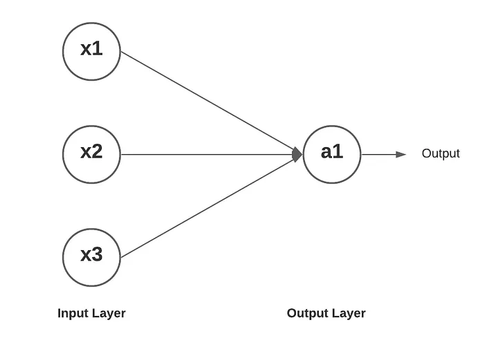

# Perceptrons:
- A single-layer neural network, also known as a single-layer perceptron, is a neural network architecture with only one layer of nodes (neurons). This layer is often referred to as the output layer.
- In a single layer neural network, each neuron in the hidden layer receives input data, processes it using certain weights, and applies an activation function to produce an output. 
- The outputs from the neurons in the hidden layer are directly connected to the output layer, which generates the final output of the network.
- The key characteristic of single layer neural networks is that they can only learn linearly separable patterns. This means they are limited to tasks where the data can be classified using a straight line or plane in the input space.

# nn.Module:
- nn.Module is a fundamental class in PyTorch used to create custom neural network architectures.
- It is a base class for all neural network modules in PyTorch.
- When creating a custom neural network in PyTorch, you typically create a subclass of nn.Module and define the architecture by specifying the layers and operations that make up your neural network

# Implmented Perceptron

: A neural network diagram showing a single-layer perceptron architecture. Three input nodes labeled x1, x2, and x3 on the left are connected with arrows to a single output node labeled a1 on the right, which connects to an Output label. The Input Layer is identified below the input nodes, and the Output Layer is identified below the output node. This represents a simple feedforward structure where all inputs connect to the single neuron.

# References
[GeekForGeeks: What is Perceptron](https://www.geeksforgeeks.org/deep-learning/what-is-perceptron-the-simplest-artificial-neural-network/)