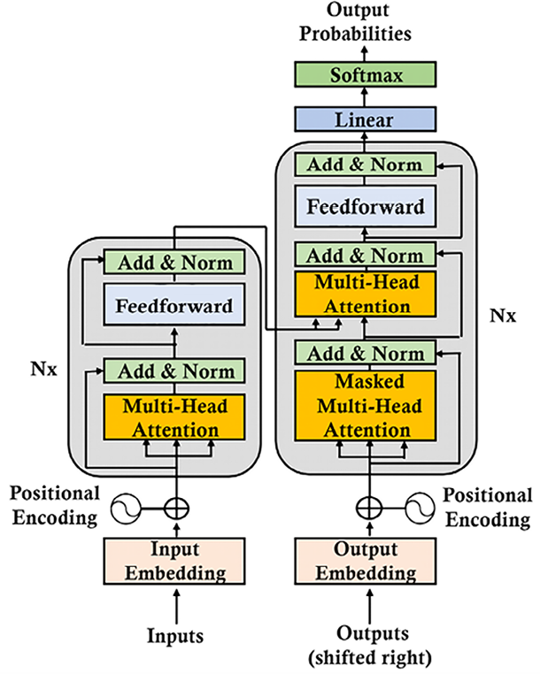
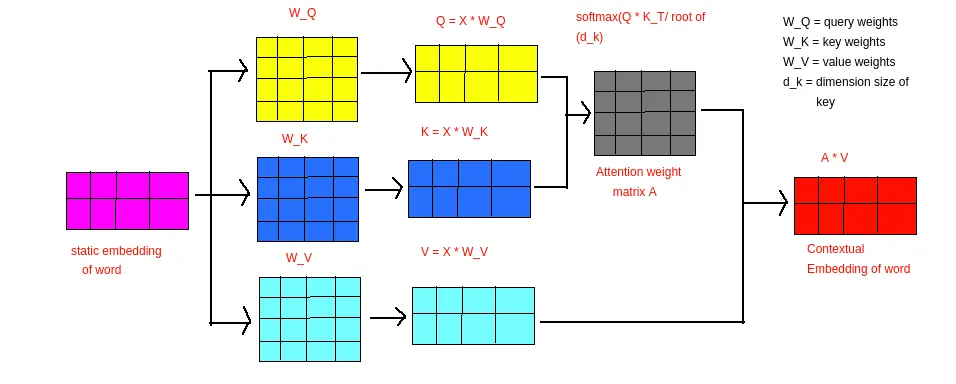
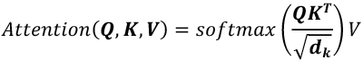
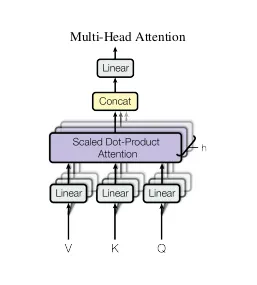

# Transformer Models:
1. In December 2017, Google Brain and Google Research published the seminal Vaswani et al., Attention Is All You Need paper. The Transformer was born.
2. Transformers were first developed to solve the problem of sequence transduction, or neural machine translation, which means they are meant to solve any task that transforms an input sequence to an output sequence. 
3. The Original Transformer models is a stack of six layers. Each layer contains sublayers.
4. There is a six-layer encoder stack on the left and a six-layer decoder stack on the right.
5. The attention mechanism is a “token-to-token” operation.
6. Attention has replaced recurrence functions requiring an increase in the number of parameters as the distance between two words increases.
7. The attention mechanism determines how each Token is related to all other Tokens in a sequence, including the word being analyzed itself.

# Definitions:
- <b><u>transformer</b></u> :
    - model is a neural network that learns the context of sequential data and generates new data out of it.
    - a type of artificial intelligence model that learns to understand and generate human-like text by analyzing patterns in large amounts of text data.
- <b><u>dimension in a Transformer model (d_model)</b></u>:
    - is the size of the numerical vectors used to represent tokens, defining the hidden state, embedding size, or feature space capacity.
    - d_model (Hidden Size): The main vector size for input/output embeddings and hidden states (e.g., 512 in original BERT/Transformer).
    - the output of every sublayer of the model has a constant dimension, including the embedding layer and the residual connections.
- <b><u>Input Tensor Shape</b></u>:
    - Usually [BatchSize, SequenceLength, EmbeddingDimension].
- <b><u>Embedding Dimension</b></u>
    - The initial vector representation of tokens, often equal to d_model.
- <b><u>Head Dimension (d_k)</b></u>:
    -In multi-head attention, is split across heads, creating smaller, specialized vectors (e.g.,  dimensions per head).

# The Original Transformer models is a stack of six layers.
- On the left, the inputs enter the encoder side of the Transformer through an attention sublayer and a feedforward sublayer.
- On the right, the target outputs go into the decoder side of the Transformer through two attention sublayers and a feedforward network sublayer.

# The Encoder:
- The primary function of the encoder is to transform the input tokens into contextualized representations.
- Unlike earlier models that processed tokens independently, the Transformer encoder captures the context of each token with respect to the entire sequence.
- Steps:
    - Step 1: Input Embeddings:
        * The encoder begins by converting input tokens - words or subwords - into vectors using embedding layers.
        * The embedding sublayer works like other standard transduction models.
        * These embeddings capture the semantic meaning of the tokens and convert them into numerical vectors.
        * All the encoders receive a list of vectors, each of size 512 (i.e. in OG transformer model) (fixed-sized). Each word (token) is embedded into a vector of size = embedding lenght (512).
        * In the bottom encoder, that would be the word embeddings, but in other encoders, it would be the output of the encoder that’s directly below them.
    - Step 2: Positional Encoding:
        * Transformers use positional encodings added to the input embeddings to provide information about the position of each token in the sequence.
        * This allows them to understand the position of each word within the sentence.
        * The idea is to add a positional encoding value to the input embedding instead of having additional vectors to describe the position of a token in a sequence.
        * OG Transformer the technique of using a unit sphere to represent positional encoding with sine and cosine values that will thus remain small but useful.
            - the sine function will be applied to the even numbers and the cosine function to the odd numbers.
            - The similarity between the position of the sample words w1 and w2 and the lexical field (groups of words that go together) similarity is different.
            - The encoding of the position shows a different similarity value than the word embedding similarity.
            - The positional encoding has taken these words differently due to the aditional positional encoding added. Hence the training corpus matters a lot.
        * The Original Transformer model has only one vector that contains word embedding and position encoding.
        * The authors of the Transformer found a simple way by merely adding the positional encoding vector to the word embedding vector.
        * This is crucial because the input undergoes parallel computations later in the architecture, and positional encoding ensures the model retains information about the order of tokens in the sequence.
    - STEP 3: Stack of Encoder Layers:
        - The multi-head attention sublayer contains eight heads and is followed by post-layer normalization, which will add residual connections to the output of the sublayer and normalize it.
    - STEP 3.1: Self-Attention Mechanism:
         
        - Transformer Multi-Head Attention: Component Breakdown:

        | Component / Step | Mathematical Operation | Dimensions (per head) | Process Insight |
        | :--- | :--- | :--- | :--- |
        | **Word (Token)** | $x$ | $(1 \times d_{model})$ | Converts a discrete word into a continuous feature vector. |
        | **Sentence (Input)** | $X$ | $(Seq\_Len \times d_{model})$ | A matrix representing the entire context of the input window. |
        | **Head Dimension** | $d_k$ | $d_{model} / num\_heads$ | Forces the model to learn 8 narrow, specialized "views." |
        | **Weight Matrices** | $W_Q, W_K, W_V$ | $(d_{model} \times d_k)$ | The "brain" that learns how to extract specific information. |
        | **Projections** | $Q, K, V$ | $(Seq\_Len \times d_k)$ | Transforms raw embeddings into Query, Key, and Value roles. |
        | **Similarity Score** | $Q \cdot K^T$ | $(Seq\_Len \times Seq\_Len)$ | - Dot product measures how much words "relate" to each other.  - Calculates how much attention each word should pay to every other word in the sequence.  - Produces a matrix of scores that reflect the similarity or compatibility between words, indicating how much one word should influence another in the context of the input sequence. |
        | **Scaling** | $Score / \sqrt{d_k}$ | $(Seq\_Len \times Seq\_Len)$ | - Keeps values small so the Softmax gradient stays stable.  - In scenarios involving high-dimensional matrices, the raw dot product scores can result in large variances, which may destabilize the training process.  - This scaling helps prevent the gradients from becoming too large during backpropagation, mitigating the risk of the vanishing gradient problem. |
        | **Normalization** | $Softmax(Score)$ | $(Seq\_Len \times Seq\_Len)$ | The softmax function ensures that all the attention weights sum to 1, making it easier to interpret these values as probabilities that dictate how much focus should be placed on each word in the sequence. |
        | **Head Output** | $Z_i = Attn(Q,K,V)$ | $(Seq\_Len \times d_k)$ | - The "Value" vectors weighted by their attention relevance.  - This step results in a set of output vectors, each representing a word in the sequence but now enriched with contextual information from the entire input sequence.|
        | **Multi-Head Output** | $Concat(Z_0...Z_n)$ | $(Seq\_Len \times d_{model})$ | Glues specialized head insights back into a single vector. |
        | **Output Projection**| $Result \cdot W_O$ | $(Seq\_Len \times d_{model})$ | A final linear layer that lets the 8 heads "talk" to each other. |
        ||
        - The input of the multi-attention sublayer of the first layer of the encoder stack is a vector that contains the embedding and the positional encoding of each word pe,
        - Inside each attention head, the input vector is transformed into three representations (Q,K,V):
            * Trainable parameters W_K, W_Q, W_V:
                1. These are Trainable Parameters/learnable weight matrices just like weights in a neural network layer.
                2. They are initialized randomly and learned during training via backpropagation.
                3. They are not part of the data; they are part of the model architecture.
                    * self.W_q = nn.Linear(d_model, d_k) # Essentially a 512 x 64 matrix
                    * self.W_k = nn.Linear(d_model, d_k)
                    * self.W_v = nn.Linear(d_model, d_k)
            * Then we do learned projections. In Deep Learning, "projection" is just a fancy term for Matrix Multiplication:
                1. Query (Q): represents what the word is looking for. [Q = XW_Q]
                2. Key (K): represents what each word offers. [K = XW_K]
                3. Value (V): contains the information passed forward. [V = XW_v]
        - Attention is defined as scaled dot-product attention, which is represented in the following equation in which we plug Q, K, and V 
         
            * step 1 - similarity score: score = QK^T.
                - The score matrix establishes the degree of emphasis each word should place on other words.
                - Therefore, each word is assigned a score in relation to other words within the same time step. A higher score indicates greater focus.
            * step 2 - scaling: score/sqrt(d_k).
                - This step is implemented to ensure more stable gradients, as the multiplication of values can lead to excessively large effects.
            * step 3 - normalization: attention_qeights = softmax(score)
                - The softmax converts scores into attention probabilities.
                - The softmax function emphasizes higher scores while diminishing lower scores, thereby enhancing the model's ability to effectively determine which words should receive more attention.
                - Higher probability = more attention to that word.
    - STEP 3.2: Multi-head attention:
     
        - Multi-Head Attention is an advanced extension of the Self-Attention mechanism used within the Transformer architecture.
        - This mechanism enhances the model’s ability to focus on different parts of an input sequence simultaneously, thereby capturing a variety of perspectives and relationships within the data.
        - The steps here:
            * Linear Projections:
                - For each attention head, the input sequence is linearly projected into separate queries (Q), keys (K), and values (V) using distinct learned weight matrices.
            * Scaled Dot-Product Attention:
                - Each set of these Q, K, and V matrices undergoes the Scaled Dot-Product Attention mechanism independently.
                - This means that for each head, the model calculates attention scores, scales them, applies the softmax function, and generates context-aware outputs
            * Concatenation:
                - After processing through the individual attention heads, the outputs of all heads are concatenated together
            * Final Linear Projection:
                - Finally, the concatenated output is passed through another linear projection using a weight matrix to produce the final output. 
                - This step integrates all the different perspectives into a single, unified representation
        - Why Multi-Head Attention:
            * Using multiple attention heads allows the model to capture a richer set of dependencies in the input sequence.
            * For example, one head might focus on the overall sentence structure, while another zooms in on specific details.
            * By combining these diverse perspectives, Multi-Head Attention provides a more comprehensive understanding of the input, much like how humans consider multiple aspects of information simultaneously.
    - STEP 3.2: Normalization and Residual Connections:
    - STEP 3.3: Feed-Forward Neural Network:
    - STEP 4: Output of the Encoder:

# Misc Notes:
1. Transformers do not analyze tokens in sequences but relate every token to the other tokens in a sequence.
2. In the late 19th and early 20th century, Andrey Markov introduced the concept of random values and created a theory of stochastic processes (see the Further reading section). We know them in AI as the Markov Decision Process (MDP), Markov chains, and Markov processes.
3. Claude Shannon laid the grounds for a communication model based on a source encoder, transmitter, and receiver or semantic decoder.
4. In 1954, the Georgetown-IBM experiment used computers to translate Russian sentences into English using a rule system.
5. In 1982, John Hopfield introduced an RNN known as Hopfield networks or “associative” neural networks.
6. In the 1980s, Yann LeCun designed the multipurpose Convolutional Neural Network (CNN).
7. In the 1990s, summing up several years of work, Yann LeCun produced LeNet-5
8. In late 2017, the industrialized state-of-the-art Transformer came with its attention head sublayers and more
9. Stanford University created the Center for Research on Foundation Models (CRFM).
10. Google invented the transformer model, leading to Google BERT, LaMBDA, PaLM 2, and more. 
11. Microsoft partnered with OpenAI to produce ChatGPT with GPT-4, and soon more.
12. A <b>Foundation Model</b> is thus a transformer model that has been trained on supercomputers on billions of records of data and billions of parameters. The model can perform a wide range of tasks without further fine-tuning

# References:
[Visual Transformer Explainer](https://poloclub.github.io/transformer-explainer/)
[Understanding Transformers](https://www.analyticsvidhya.com/blog/2024/04/understanding-transformers-a-deep-dive-into-nlps-core-technology/)
[Transformers Demystified (Part 1): Into The Transformer](https://towardsdatascience.com/into-the-transformer-5ad892e0cee/)
[Transformer Model Tutorial in PyTorch: From Theory to Code](https://www.datacamp.com/tutorial/building-a-transformer-with-py-torch)
[Introduction to Foundation Models](https://www.datacamp.com/blog/introduction-to-foundation-models)
[A Gentle Introduction to Positional Encoding in Transformer Models, Part 1](https://machinelearningmastery.com/a-gentle-introduction-to-positional-encoding-in-transformer-models-part-1/)
[Understanding Multi-Head Attention in Transformers](https://www.datacamp.com/tutorial/multi-head-attention-transformers)
[A Deep Dive into the Self-Attention Mechanism of Transformers](https://medium.com/analytics-vidhya/a-deep-dive-into-the-self-attention-mechanism-of-transformers-fe943c77e654)